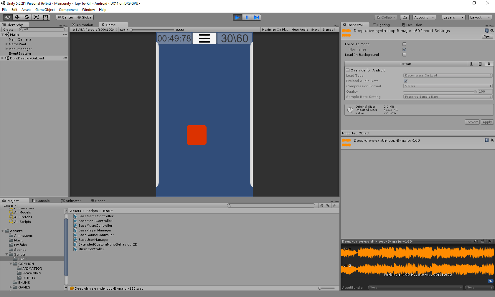

# Tap-to-kill (Arcade-catcher 2D)

## Task:
Представьте, что вы делаете прототип в проекте, который вы будете разрабатывать и поддерживать
и дальше ( продемонстрируйте, что продумали архитектуру приложения). Необходимо:
Выбрать одну из описанных ниже игр. Реализовать подключение к фейковому серверу, после коллбэка на успешное подключение
загрузить main menu с кнопкой start. Нажатие на кнопку запускает игру.(реализовать игру, используя примитивные формы или
бесплатные ассеты)
Залить проект на bitbucket/github. Продемонстрировать результат тестового в виде проекта на репозитории и .APK файла.

Tap-to-kill game V.1
Gameplay: Players will need to tap various items(random simple shapes) that pop up on the screen to score points.
Objects will pop up in random locations and it’s up to the player to tap as many objects as quickly as possible for the
highest score per 1 minute timer. Negative objects(random simple shapes marked with red color) - if hit these will
deduct points from the player’s score
Game Setup: 
 basic game setup
 random popup instantiate logic 
 negative and positive popup properties 
 popup tap logic (negative and positive popup) 
 points management 
 time logic (for 1 min timer) 
 restart 
 start and game over functionality 
 game pause functionality

## Implemented:
All

Additional:
1) Every 10 seconds we increase the frequency of the gaming of the game objects by 0.2 seconds, to the given limit of 0.5
 (all parameters can be changed in the game controller).
2) When you click on <- on a mobile device (Esc - on a computer), we pause the game (by repeatedly pressing game continuation).
3) If the game loses its focus, we automatically pause it, and when the game returns to the game, it returns.
4) Added sounds, music in the game (and the ability to adjust the volume in the Settings window).
5) Confirmation dialog window when you exit the game.

## Unity 5.6.2

